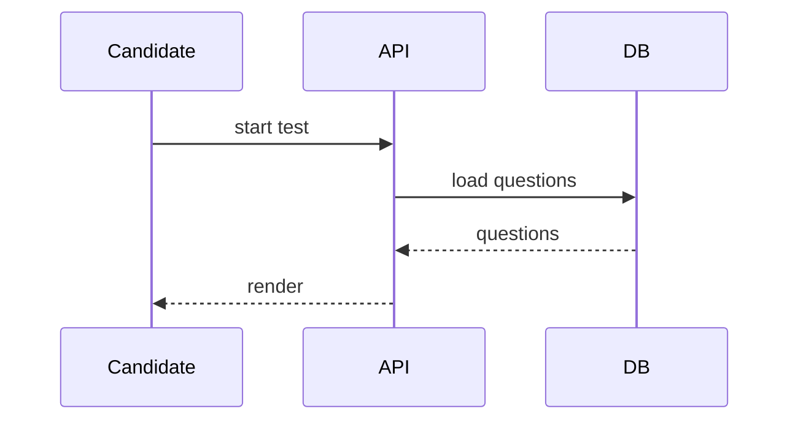

<!-- RFC-META (machine state — do not render; orchestrator reads/writes the status: line here)
project: {project-name}
trace_id: {uuid}
scenario_version: 1.3
plan_version: v1
status: CONSOLIDATED_PENDING_SECURITY
last_updated: {ISO 8601}
last_updated_by: Merger
-->

# RFC: {{Feature / System Name}}

| Field | Value |
|---|---|
| **Status** | IDEA · **RFC** · ABANDON · AGREED |
| **Owner** | {{owning team — e.g. Talent Acquisition}} |
| **Submitted Date** | {{ISO date}} |
| **Approver** | {{tech leads by name; the Infosec approver is filled by the Infosec Reviewer on approval}} |
| **Related Documents** | PRD: {{link}}; {{spokes / other refs, or N/A}} |

## 1. Overview

{{Problem, goal, and the core named components — concrete narrative. Name each
component in plain words ("the Candidate Platform", "the Test Engine"); the reader
should understand the system without a glossary.}}

### Success Criteria

{{Measurable outcomes — numbers, not adjectives. "P95 search latency < 300ms at 2M
candidates", not "fast search".}}

### Out of Scope

{{Explicit non-goals. If the PRD bundles multiple initiatives, state the scope
boundary here and name which need a sibling RFC.}}

### Related Documents

{{PRD + any spoke/design docs, or N/A.}}

### Assumptions

{{Every assumption the design relies on, listed and justified.}}

### Dependencies

{{Upstream/downstream systems, teams, or services this work depends on, or N/A.}}

### PRD Requirement Coverage

> Reconciled from the draft's Requirements Mapping + the QA coverage matrix. Proves
> every PRD requirement is addressed. Use the PRD's own labels verbatim.

| PRD requirement (PRD's own label) | Covered by (named component / section) | Notes |
|---|---|---|
| {{US1 — Candidate Index}} | {{the search service / Technical Design}} | {{}} |
| {{US2 — Faceted Search}} | {{the query service / APIs}} | {{}} |

## 2. Technical Design

### {{Option name — e.g. "Primary Path (In-House Build)"}}

{{One paragraph describing this architecture option.}}

#### Pros of This Architecture
- {{specific advantage}}

#### Cons of This Architecture
- {{specific cost / risk}}

### {{Second option name — e.g. "Optional Path using X"}}

{{Repeat Pros / Cons. Include every option seriously considered; at minimum the
chosen one. Delete extra option blocks if only one was viable, but say why.}}

### Recommendation for MVP

{{Which option is chosen and the deciding force. Plain-language reasoning.}}

### Sequence

> One diagram per user scenario where the flow differs. Mermaid, not ASCII. < ~12 nodes each.

#### Scenario 1: {{named journey — e.g. "Candidate Test Session"}}

#### Scenario 2: {{named journey}}

{{…}}

### Database Model

#### {{schema_name}} (owned by {{team / service}})

| Entity | Key fields | Relationships | Constraints |
|---|---|---|---|
| {{}} | {{}} | {{}} | {{}} |

#### Schema Permissions

{{Who reads / writes each schema, cross-service access rules.}}

### APIs

| Method | Path | Request | Response | Notes (authz, idempotency) |
|---|---|---|---|---|
| {{GET}} | {{/resource}} | {{}} | {{}} | {{}} |

## 3. High-Availability & Security

### Performance Requirement

{{P95 latency, throughput, availability — numbers, not adjectives.}}

### Monitoring & Alerting

{{Key metrics, dashboards, alarm thresholds, or N/A.}}

### Logging

{{What is logged, retention, PII handling, or N/A.}}

### Security Implications

{{Initial security posture from the design: authN/authZ model, data protection,
tenant isolation, API exposure. The Infosec Reviewer appends a Security Review
Outcome here in Phase 4.}}

### Cost Estimation

{{Infra / operational cost estimate, or N/A.}}

## 4. Backwards Compatibility and Rollout Plan

### Compatibility

{{Migrations, breaking changes, backward-compatibility approach.}}

### Rollout Strategy

{{Feature flag, staged rollout %, rollback plan.}}

## 5. Concern, Questions, or Known Limitations

### Decisions Required Before Implementation

{{Every [BLOCKED] item and unresolved decision, each with the task it blocks. Do not
bury blockers — this is where reviewers look first.}}

### Risks & Mitigations

| Risk | Impact | Likelihood | Mitigation |
|---|---|---|---|
| {{}} | {{H/M/L}} | {{H/M/L}} | {{}} |

### Open Questions

{{Anything still to resolve in grooming, with the task each blocks, or "none".}}

## 6. Tasks

| PRD Story | Task (descriptive title) | Description Task | Status |
|---|---|---|---|
| {{US1 — Candidate Index}} | {{Indexing service}} | {{What this task builds / changes}} | {{To Do}} |
| {{US2 — Faceted Search}} | {{Query service & search API}} | {{}} | {{[BLOCKED: <reason>]}} |

## 7. Comment logs

| Date | Comment(s) From | Action Item(s) |
|---|---|---|
|  |  |  |
