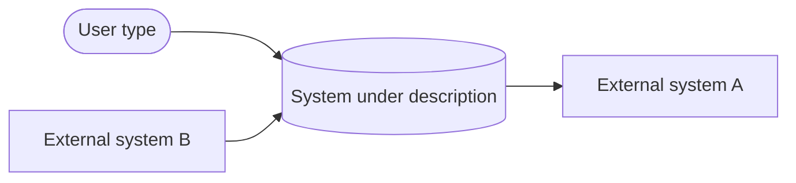
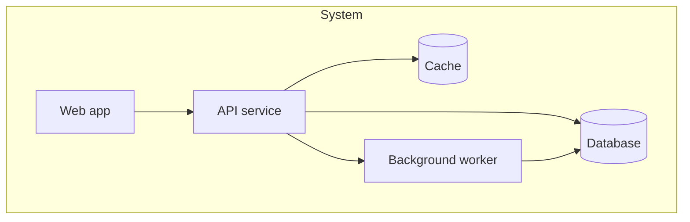
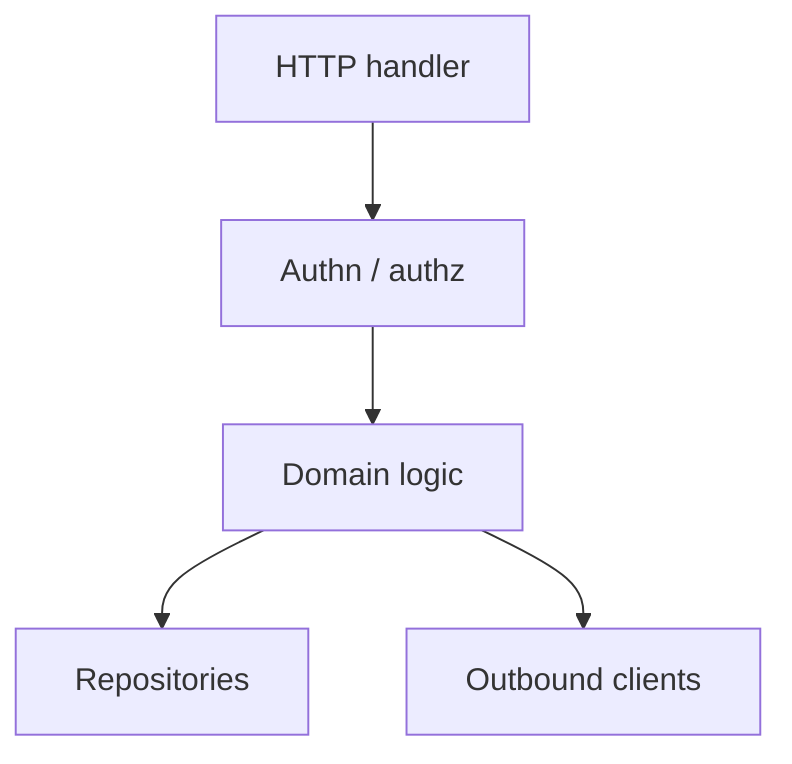

# C4 Description: {{System Name}}

A text-and-Mermaid description following the C4 model. Each level zooms in.

**Last updated:** {{YYYY-MM-DD}}

---

## Level 1 — System Context

Who uses the system and what other systems does it talk to?

**Narrative.** One paragraph: what is this system, for whom, and what's in its surroundings.

## Level 2 — Containers

What are the deployable / runnable units inside the system?

| Container | Tech (logical, not specific brand) | Responsibility |
|-----------|-----------------------------------|----------------|
| {{web}} | {{server-rendered web frontend}} | {{}} |
| {{api}} | {{HTTP/JSON API}} | {{}} |
| {{worker}} | {{async job runner}} | {{}} |
| {{db}} | {{transactional database}} | {{}} |

## Level 3 — Components

Zoom into one container at a time. Repeat this section per container that's worth detailing.

### {{Container: API service}}

| Component | Responsibility |
|-----------|----------------|
| {{HTTP handler}} | {{request parsing, validation, routing}} |
| {{Authn / authz}} | {{verify caller, attach principal}} |
| {{Domain logic}} | {{business rules — has no I/O}} |
| {{Repositories}} | {{persistence boundary}} |
| {{Outbound clients}} | {{calls to external systems}} |

## Level 4 — Code (optional)

Only describe at this level for components with non-trivial structure or known footguns. Keep it text — class names, key methods, invariants. Reserve the actual diagrams for the code itself.

## Cross-cutting

- **Auth:** {{where the trust boundary sits}}
- **Observability:** {{logs, metrics, traces}}
- **Deployment:** {{topology, regions, scaling units}}
- **Data flows of note:** {{e.g., PII handling boundary}}
