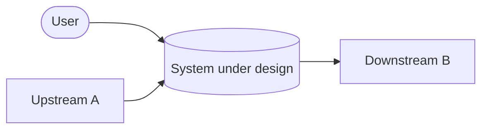

# RFC: {{Feature / System Name}}

> This is the Phase-1 RFC draft (`PLAN.md`) for the RFC orchestration pipeline.
> The section order below is the **Output Contract** — do not reorder or omit sections.
> Style rules: `references/style-guide.md`. Decision rules: `references/decision-rubric.md`.

## 1. Overview

- **Problem statement:** {{What problem does this solve? One paragraph, concrete.}}
- **Goals:** {{Goals in terms of system behavior, not implementation.}}
- **Non-goals:** {{Explicitly out of scope.}}

## 2. Requirements Mapping

> The PRD-coverage seed. **Every** PRD requirement maps to a decision/component here.
> The Merger preserves this table in the final RFC. Never omit a requirement.
> Use the PRD's own labels and titles verbatim (e.g. `US1`, "Candidate Index") — never
> re-code them. Name the component/section in "Covered by" — no bare "§3" or "T1".
> See `references/style-guide.md` → Cross-references and naming.

| PRD requirement (PRD's own label) | Type (F/NF) | Covered by (named component / section) | Notes |
|-----------------------------------|-------------|----------------------------------------|-------|
| {{e.g. US1 — Candidate Index}} | F | {{e.g. the search service / the API Design section}} | {{}} |
| {{e.g. US2 — Bulk Import}} | NF | {{e.g. the ingestion worker / the Infrastructure section}} | {{}} |

Non-functional targets (numbers, not adjectives — see style-guide; TBD if unknown — never invent):

| Property | Target |
|----------|--------|
| Latency (P95) | {{e.g., < 200ms}} |
| Throughput | {{e.g., 10k req/s sustained}} |
| Availability | {{e.g., 99.9%}} |
| Durability | {{e.g., RPO 60s, RTO 5min}} |
| Consistency | {{e.g., strong on writes, read-after-write within 1s}} |

## 3. Architecture Design

### Components

| Component | Responsibility (one sentence) |
|-----------|-------------------------------|
| {{Name}} | {{What it owns.}} |

### Interaction flow

Step through the primary path end-to-end:

1. {{Step}}
2. {{Step}}

### High-level diagram (MANDATORY — Mermaid, not ASCII)

> For multi-surface features, add a second Mermaid diagram for the secondary flow
> (e.g. authoring vs. send-path). Keep each diagram under ~12 nodes.

## 4. Data Model (Logical Only)

| Entity | Key fields | Relationships | Constraints (indexes, uniqueness, retention) |
|--------|-----------|---------------|----------------------------------------------|
| {{}} | {{}} | {{}} | {{}} |

Include a schema migration approach if this design touches existing data.

## 5. API Contract (Interface Only)

> Interface shapes only. No implementation code. Illustrative request/response shapes are allowed.

| Method | Path | Request shape | Response shape | Notes (authz, idempotency) |
|--------|------|---------------|----------------|----------------------------|
| {{GET}} | {{/resource}} | {{}} | {{}} | {{}} |

## 6. Infrastructure

- **Deployment model:** {{single deploy / staged / feature-flagged}}
- **Scaling approach:** {{horizontal/vertical, autoscaling triggers}}
- **Topology:** {{regions, availability zones, scaling units}}
- **Rollout & rollback:** {{feature flag / staged % / rollback trigger}}
- **Observability:** {{monitoring, alerting, logging — what signals prove it works}}
- **Cost estimate:** {{infra + effort drivers; `TBD:` if unknown}}
- **Security posture:** {{authn/z model, data classification, tenant isolation}}

## 7. Trade-offs & Alternatives

> For each major decision: 2–3 options with pros/cons/risks/cost; the chosen option with justification.
> Apply `references/decision-rubric.md`. Spin the largest decisions out into ADRs (`assets/adr-template.md`).

### {{Decision — e.g., "Synchronous vs. event-driven processing"}}

- **Chosen:** {{option}}
- **Considered:** {{alternative(s)}}
- **Pros / Cons / Risk / Cost:** {{specific forces — not "simpler"}}
- **Why chosen:** {{the deciding force}}

## 8. Technical Assumptions

> Every assumption used anywhere in the body MUST be listed and justified here.

| # | Assumption | Justification |
|---|------------|---------------|
| A1 | {{}} | {{}} |

## 9. Risks & Mitigations

> Minimum 3 risks for non-trivial designs (small changes: list what's real, don't pad). Each with impact, likelihood, and mitigation.

| # | Risk | Impact | Likelihood | Mitigation |
|---|------|--------|------------|------------|
| 1 | {{}} | {{H/M/L}} | {{H/M/L}} | {{}} |
| 2 | {{}} | {{}} | {{}} | {{}} |
| 3 | {{}} | {{}} | {{}} | {{}} |

## 10. Open Questions

- {{Anything unresolved at hand-back, or "none"}}
