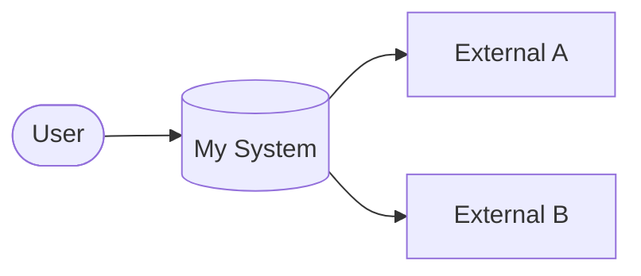
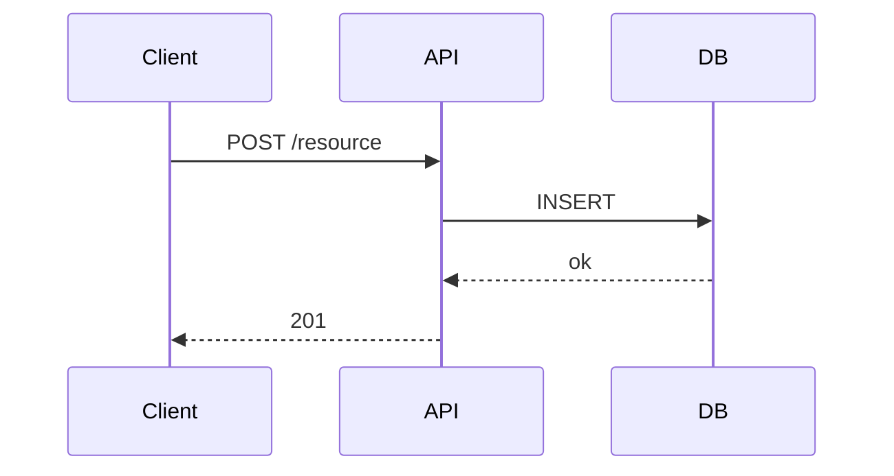
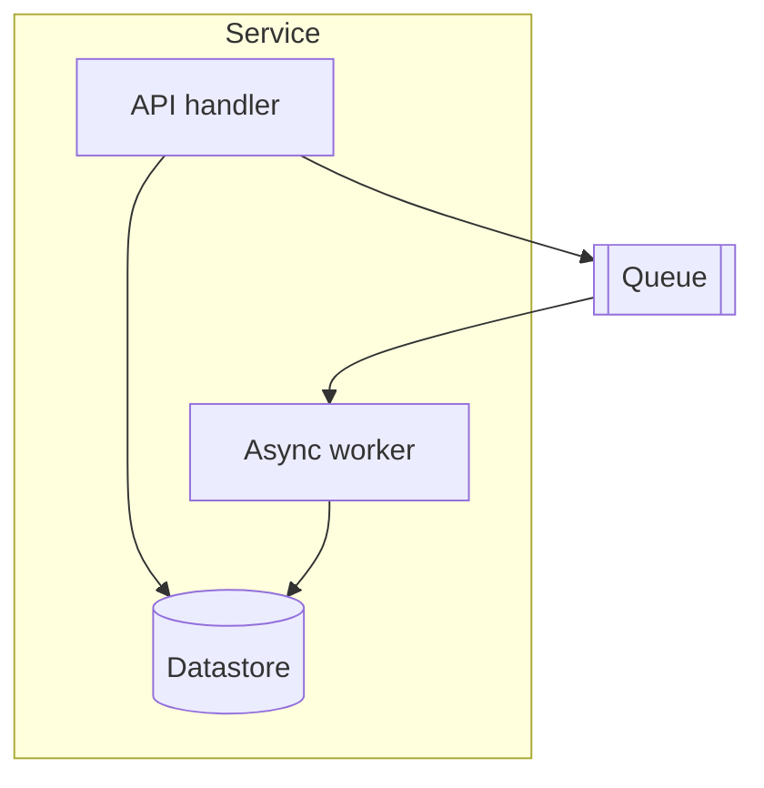

# Style Guide — Architecture Design

How to write, not what to write. The templates in `assets/` define structure.

## Language: Simplified Technical English (ASD-STE100) — the default

All RFC prose (`PLAN.md`, `PLAN_FINAL.md`) is written in the **Document register** of the `simple-english` skill. Before drafting, `Read` `~/.claude/skills/simple-english/SKILL.md` and apply its "The Document" rules; consult `~/.claude/skills/simple-english/references/word-swaps.md` for plain replacements of overused words.

The load-bearing rules, restated:

- Procedural text: imperative mood, max 20 words per sentence, one instruction per sentence. Descriptive text: simple tenses, max 25 words per sentence, one topic per paragraph.
- Active voice; simple tenses only (no present perfect); name the actor.
- Modals: **can, will, must** only — never should, would, may, might, could.
- One word, one meaning across the whole document. No contractions, no semicolons, no em-dashes.
- Condition before command, with a comma: "If the build fails, read the log."
- Define each concept term at first use, under ten words. Do not define product or standard names.
- State the fact, not its importance — delete "robust", "seamlessly", "crucial", "in order to", "it is worth noting".

**Scope limits (RFC pipeline specific):**

- Apply the **Document register only**. The skill's "Reply" register (5-sentence chat limit) does NOT apply to hand-back messages, gate prompt blocks, `debug.json` events, or review files — those follow the orchestration protocol verbatim.
- Never touch code, identifiers, Mermaid blocks, file paths, quoted errors, PRD labels (`US1`, "Candidate Index"), status headers, or template-mandated section names.
- Strict STE vocabulary mode runs only when the user explicitly asks for STE compliance; the default is the Plain mode above.

## Voice

- **Past tense for decisions made.** "We chose event sourcing because …"
- **Present tense for system behavior.** "The ingestion service deduplicates by message ID."
- **Active voice.** "The scheduler triggers the job." not "The job is triggered by the scheduler."
- **No marketing language.** Avoid "robust", "scalable", "world-class", "seamless". Replace with the actual property and a number.

## Specificity

Replace adjectives with numbers wherever possible:

| Vague | Specific |
|-------|----------|
| "high throughput" | "10,000 events/sec sustained, 50,000 peak" |
| "low latency" | "P95 < 100ms end-to-end" |
| "highly available" | "99.95% monthly uptime across two regions" |
| "consistent" | "Strong consistency on writes; reads within 1s of writes" |
| "secure" | "AES-256 at rest; TLS 1.3 in transit; rotated every 90 days" |

If the number isn't known, mark it `**TBD: target ___?**` and ask, don't invent.

## Diagrams

Always use Mermaid. Never embed images.

### System context (C4 Level 1)

### Sequence

### Component / container

Keep diagrams under ~12 nodes. If a diagram gets bigger than that, split it into multiple levels.

## Cross-references and naming (read this — it's the #1 readability failure)

The RFC is read once, top to bottom, by people who did not write it. The #1 readability failure is referring to things by codes the RFC **invented itself** — "T1", "§5", "TC3" — which don't exist anywhere the reader has seen, so every reference becomes a lookup. That reads like source code, not engineering writing.

**Two rules:**

**1. Mirror the PRD's own labels verbatim — never re-code them.** Whatever the PRD calls a requirement or story, the RFC uses that exact label. If the PRD says `US1`, write `US1`. If the PRD names a story "Candidate Index", write "Candidate Index" — do not relabel it "R1" or "Story 3". The reader already knows the PRD's vocabulary; inventing a parallel ID scheme just to map back to the PRD is the confusion.

**2. For things the RFC introduces itself (tasks, sections, tests), refer to them by descriptive name, not an invented code.**

| ❌ Invented code | ✅ Name the reader can follow |
|---|---|
| "See T1." | "The token-rotation task handles this." |
| "Covered on §5." / "see §2" | "The API Design section covers this." |
| "Validated by TC3." | "The session-expiry test validates this." |
| "R1 maps to §3, T1" | "Candidate Index (from the PRD) maps to the search service and its indexing task" |

Specifics:

- **Requirements / user stories: copy the PRD's label and title exactly.** `US1`, "Candidate Index" — whatever the PRD uses, carried through unchanged. This is the *one* place codes are fine, because they're the PRD's codes, not ours.
- **Tasks get a short descriptive title and are referred to by that title** — "the token-rotation task", not "T1". A table may keep a stable row key, but the prose around it must name the task.
- **Cross-section references use the section's title** — "the Data Model section", not "§4".
- **Test cases are referred to by what they test** plus their description — "the expiry-boundary test", not a bare "TC7".
- **The prose must read correctly with every table deleted.** Tables carry traceability; sentences carry meaning. A sentence whose meaning lives in a code you'd have to look up is a broken sentence.

> Numbered section *headings* ("## 4. Data Model") are fine and conventional. The rule is about *references inside the prose* — those use names (or the PRD's own labels), never RFC-invented "§N" / "T#" / "TC#".

## Decisions and trade-offs

Every architecturally meaningful choice needs:

1. **What** — the decision in one sentence.
2. **Why** — the forces that drove it (constraints, requirements, prior decisions).
3. **Alternatives** — at least one realistic option you considered and rejected, with the reason.
4. **Consequences** — what becomes harder, more expensive, or impossible because of this choice.

Skipping any of these four is the most common failure mode of design documents. Don't skip them.

## What goes in HLD vs. LLD

- **HLD (High-Level Design):** what the system is, who it talks to, the major components, the data flow at a coarse level, the key cross-cutting concerns (auth, observability, deployment).
- **LLD (Low-Level Design):** how each component is structured internally — modules, key classes/functions, data schemas, error-handling rules, retry/backoff policy, concurrency model.

If a small project doesn't need both, write a single combined doc. If a large project does, split them — but cross-reference.

## What to leave out

- Implementation details that belong in code comments.
- Library version pins (these go in dependency files, not design docs).
- Anything that will be obsolete in a sprint.
- Internal team gossip ("we're doing X because the platform team won't let us …" — restate as a constraint instead).

## Length discipline

A design doc is a reading document, not a reference manual. Target:

- **Overview** in 5 lines or less.
- **Goals + Non-Goals** combined under one page.
- **Whole document** under ~10 pages of prose. If it's longer, you probably have multiple designs in one doc — split them.

A 25-page design doc that nobody reads is worse than a 5-page one that everybody does.
